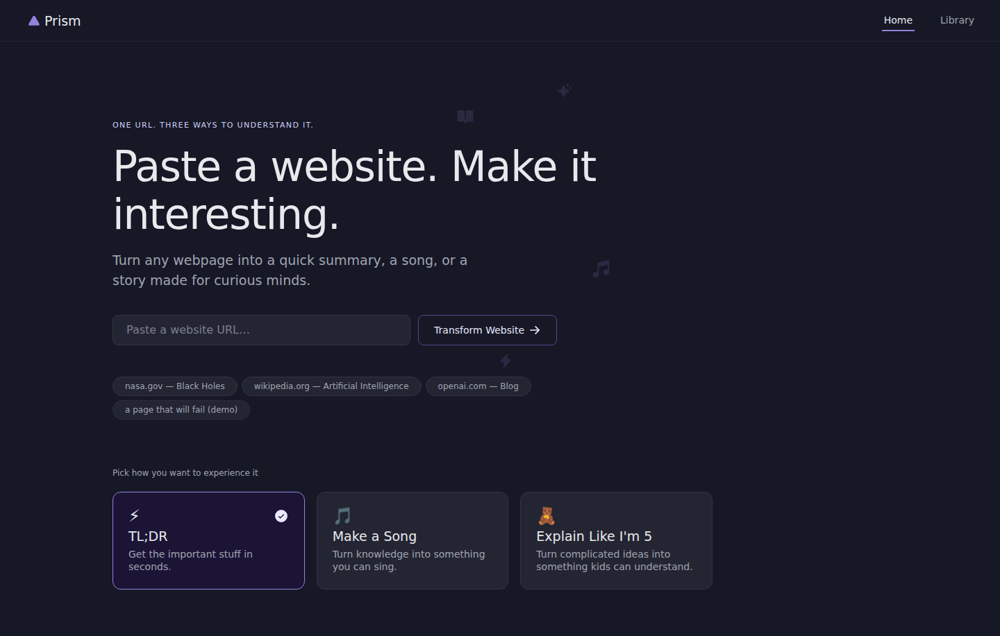
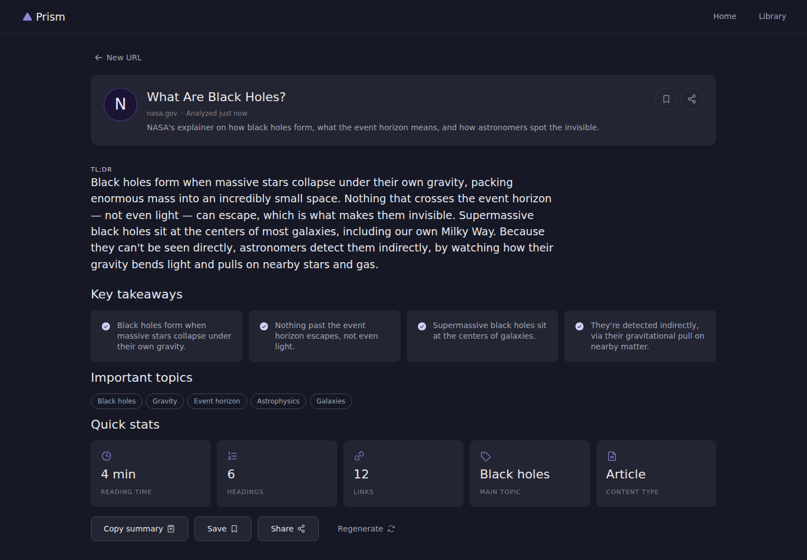

# Prism

**One URL. Three ways to understand it.**

Paste a website. Pick a mode. Get a fast TL;DR, a full song written from the
page, or a kid-friendly explanation with a story and a quiz — one mode at a
time, real AI under the hood.

Built for the Outskill Hackathon.

<p>
  
</p>
<p>
  
</p>

## Status

| Mode | Status |
|---|---|
| ⚡ TL;DR | **Live** — real extraction + real Gemini summary |
| 🎵 Make a Song | In progress — shared shell works, AI transform not wired up yet |
| 🧸 Explain Like I'm 5 | In progress — shared shell works, AI transform not wired up yet |

Landing, processing animation, error handling, save/share, and the Library
all work today for every mode. See [`docs/FEATURES.md`](docs/FEATURES.md)
for exactly what's left and how to build it.

## Tech stack

- **Frontend**: Vite + React, plain CSS (custom properties + CSS Modules,
  no utility framework) — the "Nocturne" design system lives in
  `src/design-system/`.
- **Backend**: Vercel serverless functions (`/api`), no separate server to
  run or host.
- **AI**: [Google Gemini](https://aistudio.google.com/apikey) (free tier,
  no card) for text — summaries, lyrics, kid explanations, quizzes. Real
  song *audio* (once built) uses [ElevenLabs Music](https://elevenlabs.io)
  (paid — see `docs/FEATURES.md#feature-make-a-song-mode`), with a graceful
  fallback to a simulated player when no key is configured.
- **Icons**: [Phosphor Icons](https://phosphoricons.com/).
- **Deployment**: [Vercel](https://vercel.com) — static frontend + `/api`
  functions, zero-config.

## Quickstart

```bash
git clone https://github.com/MYadnyesh/Outskill-Hackathon.git
cd Outskill-Hackathon
npm install
cp .env.example .env.local   # add your GEMINI_API_KEY
npm run dev                  # UI only, mock data, no keys needed
# or
npm run dev:full             # full stack (needs `npm i -g vercel` once)
```

Get a free Gemini key at https://aistudio.google.com/apikey — no credit
card required.

Full contributor workflow (branches, PRs, testing) is in
[`CONTRIBUTING.md`](CONTRIBUTING.md).

## Deploying to Vercel

1. Push this repo to GitHub (already done if you're reading this from the
   repo).
2. Go to https://vercel.com/new, import the GitHub repo. Vercel
   auto-detects Vite — no config needed beyond the defaults.
3. Under **Project Settings → Environment Variables**, add `GEMINI_API_KEY`
   (and `ELEVENLABS_API_KEY` once Song mode needs it). These are separate
   from your local `.env.local` — Vercel doesn't read that file.
4. Deploy. Every push to `main` auto-deploys after that; every PR gets its
   own preview URL.

## Project structure

```
api/analyze.js          the one backend endpoint (POST url+mode -> result)
lib/extract.js           real server-side URL scraping (cheerio)
lib/gemini.js             thin Gemini REST client
lib/transforms/tldr.js    the one finished AI transform (reference pattern)
src/design-system/        tokens, base styles, shared component kit
src/state/AppState.jsx    the whole app's state machine
src/api/client.js         frontend -> backend, with mock-data fallback
src/mock/demoData.js      canned "black holes" dataset, all 3 modes
src/screens/              Landing, Processing, Error, Results, Library
scripts/test-api.js       local smoke test for api/analyze.js (no CLI needed)
scripts/test-extract.js   unit test for HTML parsing (no network needed)
docs/FEATURES.md          what's left to build + exact specs
```

## Design system

"Nocturne" — a quiet, compact dark UI: near-black blue-grey ground
(`#161826`), a single blurple accent (`#9184d9`) used only as outlines,
small fills, and glows (never a solid flood), Inter at up to weight 500
only, an 8px base radius, and OKLCH-derived neutral/accent ramps. Tokens
are defined once in `src/design-system/tokens.css` — always pull from
there rather than hardcoding a color or spacing value.

## Known limitations (by design, for now)

- No accounts, no real persistence beyond the current browser session (the
  Library resets on reload) — matches the hackathon scope.
- Song and Kid mode show a "coming soon" placeholder until their AI
  transforms are wired up (see `docs/FEATURES.md`).
- Google Fonts (Inter) requires normal internet access to load — it won't
  render in network-restricted sandboxes, only real browsers/deployments.
